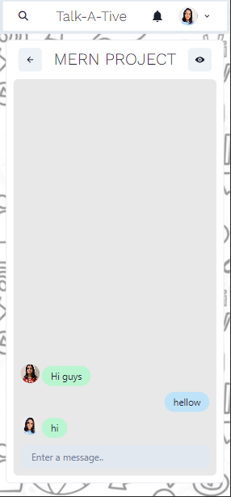

# Chatter Hub

Successfully developed and implemented a feature-rich chat application utilizing cutting-edge technologies. The project includes user authentication, real-time individual and group chat functionalities, group creation, and management, as well as dynamic group member addition and removal. Implemented Socket.IO for real-time notifications and messages, enhancing user engagement. Utilized React, Chakra UI, and Material UI for a seamless and intuitive frontend experience, complemented by a robust backend built with Node.js, Express.js, and MongoDB. Cloudenery was employed for efficient cloud storage. The project showcases a commitment to innovation and proficiency in full-stack development.

## Table of Contents

- [Features](#features)
- [Technologies Used](#technologies-used)
- [Getting Started](#getting-started)
- [Installation](#installation)
- [Usage](#usage)

## Introduction

Chatter Hub is a real-time chat application that provides individual and group chat functionalities. Users can communicate seamlessly, create groups, and enjoy a responsive chatting experience.

## Features

- User Authentication (Login and Sign Up)
- Individual and Group Chat
- Create and Edit Groups
- Add and Remove Members from Groups
- Real-Time Notifications and Messages
- Real-Time Typing Indication
- Group Management (Create, Edit, Remove)
- User Search
- Responsive Design

## Technologies Used

### Frontend

- React
- Chakra UI
- Material UI
- Cloudinary (for image storage)

### Backend

- Node.js
- Express.js
- Socket.io
- MongoDB

## Getting Started

To run Chatter Hub, you need to set up both the frontend and the backend. Follow the steps below to get started.

## Installation

### Frontend

1. Clone the repository: `git clone https://github.com/laxmi124/chatter-hub/tree/master/frontend`
2. Navigate to the project directory: `cd frontend`
3. Install dependencies: `npm install`
4. Start the development server: `npm start`

### Backend

1. Clone the repository: `git clone https://github.com/laxmi124/chatter-hub/tree/master/backend`
2. Navigate to the project directory: `cd backend`
3. Install dependencies: `npm install`
4. Set up MongoDB and Cloudinary credentials in the appropriate configuration files.
5. Start the server: `npm start`

## Usage

1. Visit the http://localhost:3000 in your browser.
2. Sign up or log in to start using the chat application.
3. Explore the features mentioned in the Features section.

